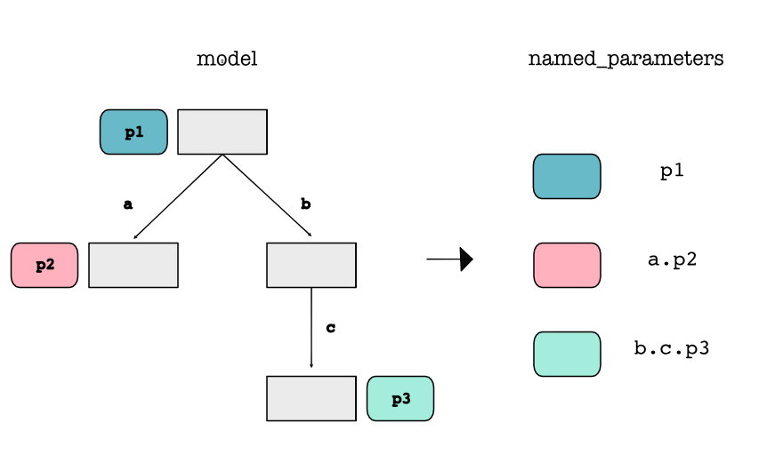
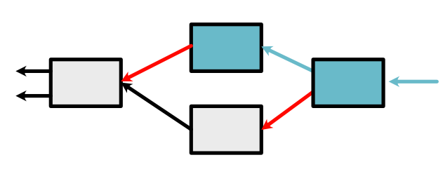
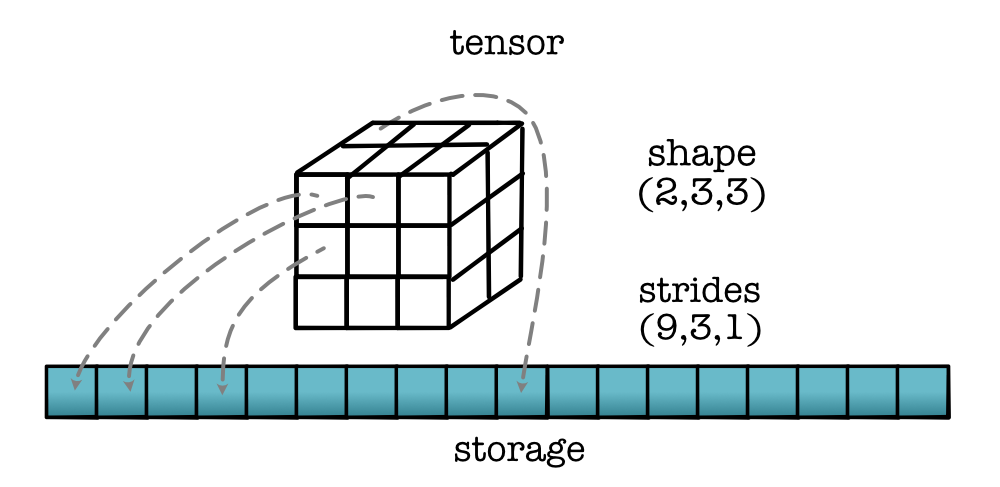
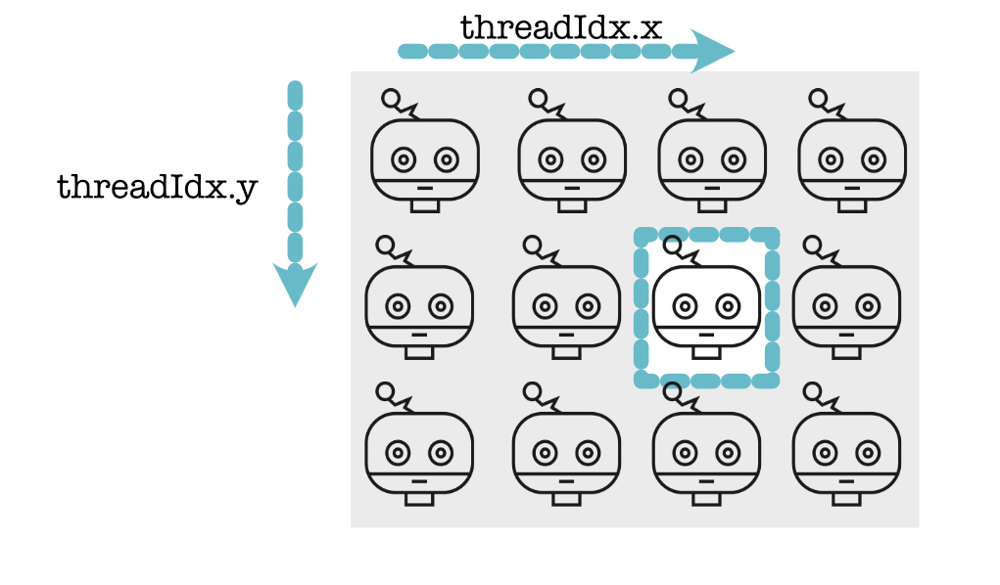
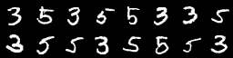

# MiniTorch

Own implementation of [MiniTorch](https://minitorch.github.io/) for fun and glory. MiniTorch is a teaching library for machine learning engineers who wish to learn about the internal concepts underlying deep learning systems. Specifically, it is a pure Python re-implementation of the Torch API designed to be simple, easy-to-read, tested, and incremental. The final library can run Torch code with minimal changes (at some efficiency cost). The project was developed for the course Machine Learning Engineering at Cornell Tech.

## Module 0 - Fundamentals

## Module 1 - Auto-Differentiation

## Module 2 - Tensors

## Module 3 - Efficiency

## Module 4 - Networks

